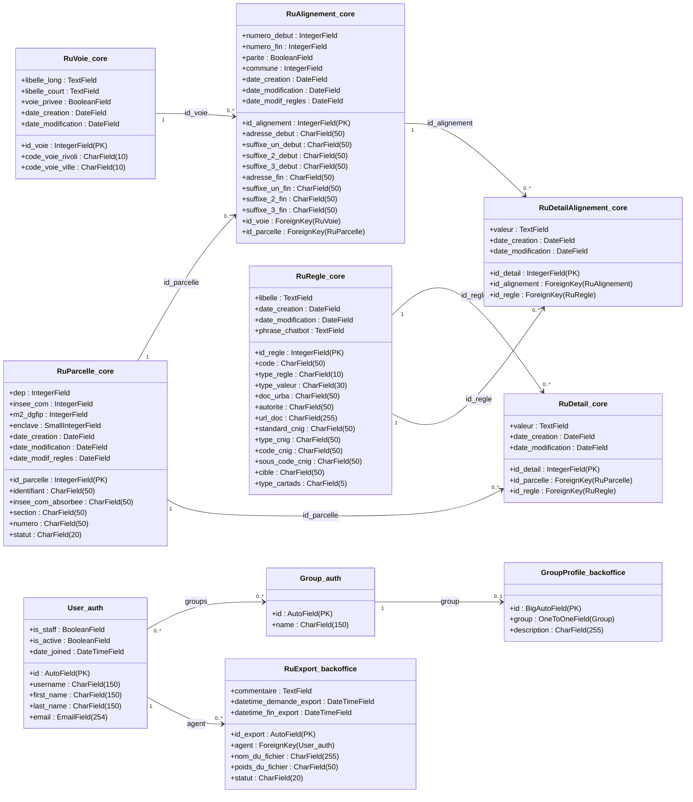

```mermaid
classDiagram
direction LR

class RuVoie_core {
  +id_voie : IntegerField (PK)
  +libelle_long : TextField
  +libelle_court : TextField
  +code_voie_rivoli : CharField(10)
  +code_voie_ville : CharField(10)
  +voie_privee : BooleanField
  +date_creation : DateField
  +date_modification : DateField
}

class RuParcelle_core {
  +id_parcelle : IntegerField (PK)
  +identifiant : CharField(50)
  +dep : IntegerField
  +insee_com : IntegerField
  +insee_com_absorbee : CharField(50)
  +section : CharField(50)
  +numero : CharField(50)
  +m2_dgfip : IntegerField
  +enclave : SmallIntegerField
  +statut : CharField(20)
  +date_creation : DateField
  +date_modification : DateField
  +date_modif_regles : DateField
}

class RuAlignement_core {
  +id_alignement : IntegerField (PK)
  +numero_debut : IntegerField
  +adresse_debut : CharField(50)
  +suffixe_un_debut : CharField(50)
  +suffixe_2_debut : CharField(50)
  +suffixe_3_debut : CharField(50)
  +numero_fin : IntegerField
  +adresse_fin : CharField(50)
  +suffixe_un_fin : CharField(50)
  +suffixe_2_fin : CharField(50)
  +suffixe_3_fin : CharField(50)
  +id_voie : ForeignKey(RuVoie)
  +parite : BooleanField
  +id_parcelle : ForeignKey(RuParcelle)
  +commune : IntegerField
  +date_creation : DateField
  +date_modification : DateField
  +date_modif_regles : DateField
}

class RuRegle_core {
  +id_regle : IntegerField (PK)
  +code : CharField(50)
  +type_regle : CharField(10)
  +type_valeur : CharField(30)
  +libelle : TextField
  +doc_urba : CharField(50)
  +autorite : CharField(50)
  +url_doc : CharField(255)
  +standard_cnig : CharField(50)
  +type_cnig : CharField(50)
  +code_cnig : CharField(50)
  +sous_code_cnig : CharField(50)
  +cible : CharField(50)
  +date_creation : DateField
  +date_modification : DateField
  +phrase_chatbot : TextField
  +type_cartads : CharField(5)
}

class RuDetail_core {
  +id_detail : IntegerField (PK)
  +id_parcelle : ForeignKey(RuParcelle)
  +id_regle : ForeignKey(RuRegle)
  +valeur : TextField
  +date_creation : DateField
  +date_modification : DateField
}

class RuDetailAlignement_core {
  +id_detail : IntegerField (PK)
  +id_alignement : ForeignKey(RuAlignement)
  +id_regle : ForeignKey(RuRegle)
  +valeur : TextField
  +date_creation : DateField
  +date_modification : DateField
}

class RuExport_backoffice {
  +id_export : AutoField (PK)
  +agent : ForeignKey(User_auth)
  +commentaire : TextField
  +nom_du_fichier : CharField(255)
  +poids_du_fichier : CharField(50)
  +statut : CharField(20)
  +datetime_demande_export : DateTimeField
  +datetime_fin_export : DateTimeField
}

class GroupProfile_backoffice {
  +id : BigAutoField (PK)
  +group : OneToOneField(Group)
  +description : CharField(255)
}

class User_auth {
  +id : AutoField (PK)
  +username : CharField(150)
  +first_name : CharField(150)
  +last_name : CharField(150)
  +email : EmailField(254)
  +is_staff : BooleanField
  +is_active : BooleanField
  +date_joined : DateTimeField
}

class Group_auth {
  +id : AutoField (PK)
  +name : CharField(150)
}

RuVoie_core "1" --> "0..*" RuAlignement_core : id_voie
RuParcelle_core "1" --> "0..*" RuAlignement_core : id_parcelle

RuParcelle_core "1" --> "0..*" RuDetail_core : id_parcelle
RuRegle_core "1" --> "0..*" RuDetail_core : id_regle

RuAlignement_core "1" --> "0..*" RuDetailAlignement_core : id_alignement
RuRegle_core "1" --> "0..*" RuDetailAlignement_core : id_regle

Group_auth "1" --> "0..1" GroupProfile_backoffice : group
User_auth "0..*" --> "0..*" Group_auth : groups
User_auth "1" --> "0..*" RuExport_backoffice : agent
```